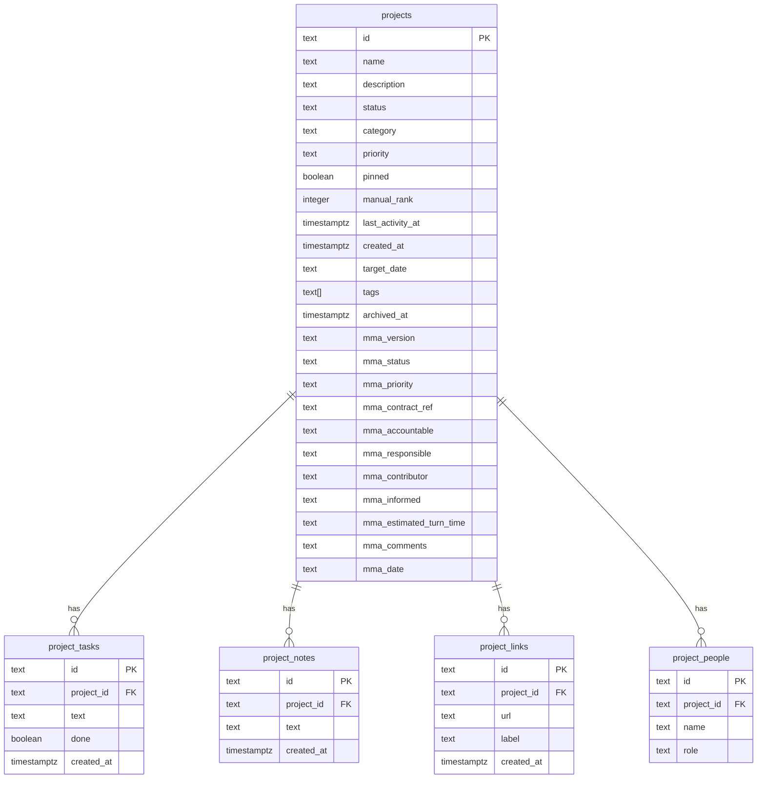

# feat: Add Supabase backend with auth and real-time sync

## Overview

Replace the localStorage-only persistence in mma-tracker with a Supabase backend so multiple users can collaborate on the same shared board in real-time. Add email/password authentication via Supabase Auth. GitHub Pages hosting stays unchanged — Supabase is accessed via client-side JS SDK.

## Problem Statement / Motivation

Currently every user sees their own isolated copy of the board (localStorage). When one person moves a card, archives a project, or adds a task, no one else sees the change. This defeats the purpose of a team tracker. The team needs a shared, persistent, real-time board.

## Proposed Solution

### Architecture

```
GitHub Pages (static SPA)
    ↓ HTTPS
Supabase (hosted Postgres + Auth + Realtime)
    ├── Auth: email/password, open signup
    ├── Database: projects table + normalized sub-tables
    ├── Realtime: postgres_changes subscriptions
    └── RLS: all authenticated users = full access
```

### Schema Design: Normalized (not JSONB)

**Critical decision:** The `BaseballCardProject` type contains nested arrays (`tasks[]`, `notes[]`, `links[]`, `people[]`). Storing these as JSONB columns in a single `projects` row would cause **silent data loss** when two users concurrently edit different nested arrays on the same project (last-write-wins overwrites the entire JSONB blob).

**Solution:** Normalize into separate tables with foreign keys. This makes Realtime subscriptions granular (a new task insert doesn't trigger a full project row update) and eliminates the JSONB conflict problem.



**ID column type: `text`** — Existing seed data uses IDs like `task-01`, `p-david`. Using `text` preserves compatibility. New IDs will still use `crypto.randomUUID()`.

### Auth Design

- **Supabase Auth** with email/password
- **Open signup** — anyone can register
- **Email confirmation disabled** for V1 simplicity (avoids redirect URL complexity on GitHub Pages)
- **All authenticated users are equal** — no roles
- **Full-page login gate** — no access without authentication
- **Password reset** — "Forgot password?" link using Supabase `resetPasswordForEmail` (V2 consideration)

### Real-Time Design

- Subscribe to `postgres_changes` on all 5 tables (`projects`, `project_tasks`, `project_notes`, `project_links`, `project_people`)
- **Optimistic updates** — update local state immediately, write to Supabase async. On failure, show toast error (no automatic rollback for V1).
- **Self-event deduplication** — track pending write IDs; ignore Realtime events for writes we initiated.
- **Reconnection** — on WebSocket reconnect, do a full re-fetch of all projects to recover missed events.

### Conflict Resolution

- **Last-write-wins** at the row level per table
- With normalized tables, concurrent edits to different sub-entities (e.g., User A adds a task, User B adds a note) no longer conflict
- `reorderSpotlight` multi-row rank updates: use a Supabase RPC function (Postgres function) to update ranks atomically in a transaction

## Technical Approach

### Implementation Phases

#### Phase 1: Supabase Project + Schema (no code changes)

**Tasks:**
- [x] Create Supabase project (free tier)
- [x] Install Supabase CLI: `brew install supabase/tap/supabase`
- [x] Run `supabase init` in the repo root
- [x] Create migration: `supabase migration new create_schema`
- [x] Write SQL for all 5 tables with RLS policies
- [x] Enable Realtime publication on all tables
- [ ] Link to remote project: `supabase link --project-ref <ref>`
- [ ] Push migrations: `supabase db push`
- [ ] Seed the database with `SEED_PROJECTS` data

**Files:**
- `supabase/config.toml` (generated by `supabase init`)
- `supabase/migrations/YYYYMMDDHHMMSS_create_schema.sql` (new)
- `supabase/seed.sql` (new — insert seed data)

**SQL sketch for the migration:**

```sql
-- projects table
CREATE TABLE projects (
  id text PRIMARY KEY,
  name text NOT NULL,
  description text NOT NULL DEFAULT '',
  status text NOT NULL DEFAULT 'active',
  category text NOT NULL DEFAULT '',
  priority text NOT NULL DEFAULT 'medium',
  pinned boolean NOT NULL DEFAULT false,
  manual_rank integer,
  last_activity_at timestamptz NOT NULL DEFAULT now(),
  created_at timestamptz NOT NULL DEFAULT now(),
  target_date text,
  tags text[] NOT NULL DEFAULT '{}',
  archived_at timestamptz,
  mma_version text NOT NULL DEFAULT '',
  mma_status text NOT NULL DEFAULT 'TBD',
  mma_priority text NOT NULL DEFAULT 'Medium',
  mma_contract_ref text NOT NULL DEFAULT '',
  mma_accountable text NOT NULL DEFAULT '',
  mma_responsible text NOT NULL DEFAULT '',
  mma_contributor text NOT NULL DEFAULT '',
  mma_informed text NOT NULL DEFAULT '',
  mma_estimated_turn_time text NOT NULL DEFAULT '',
  mma_comments text NOT NULL DEFAULT '',
  mma_date text NOT NULL DEFAULT ''
);

-- sub-tables
CREATE TABLE project_tasks (
  id text PRIMARY KEY,
  project_id text NOT NULL REFERENCES projects(id) ON DELETE CASCADE,
  text text NOT NULL,
  done boolean NOT NULL DEFAULT false,
  created_at timestamptz NOT NULL DEFAULT now()
);

CREATE TABLE project_notes (
  id text PRIMARY KEY,
  project_id text NOT NULL REFERENCES projects(id) ON DELETE CASCADE,
  text text NOT NULL,
  created_at timestamptz NOT NULL DEFAULT now()
);

CREATE TABLE project_links (
  id text PRIMARY KEY,
  project_id text NOT NULL REFERENCES projects(id) ON DELETE CASCADE,
  url text NOT NULL,
  label text NOT NULL DEFAULT '',
  created_at timestamptz NOT NULL DEFAULT now()
);

CREATE TABLE project_people (
  id text PRIMARY KEY,
  project_id text NOT NULL REFERENCES projects(id) ON DELETE CASCADE,
  name text NOT NULL,
  role text
);

-- RLS: all authenticated users can do everything
ALTER TABLE projects ENABLE ROW LEVEL SECURITY;
ALTER TABLE project_tasks ENABLE ROW LEVEL SECURITY;
ALTER TABLE project_notes ENABLE ROW LEVEL SECURITY;
ALTER TABLE project_links ENABLE ROW LEVEL SECURITY;
ALTER TABLE project_people ENABLE ROW LEVEL SECURITY;

CREATE POLICY "auth_all" ON projects FOR ALL TO authenticated USING (true) WITH CHECK (true);
CREATE POLICY "auth_all" ON project_tasks FOR ALL TO authenticated USING (true) WITH CHECK (true);
CREATE POLICY "auth_all" ON project_notes FOR ALL TO authenticated USING (true) WITH CHECK (true);
CREATE POLICY "auth_all" ON project_links FOR ALL TO authenticated USING (true) WITH CHECK (true);
CREATE POLICY "auth_all" ON project_people FOR ALL TO authenticated USING (true) WITH CHECK (true);

-- Enable Realtime
ALTER PUBLICATION supabase_realtime ADD TABLE projects;
ALTER PUBLICATION supabase_realtime ADD TABLE project_tasks;
ALTER PUBLICATION supabase_realtime ADD TABLE project_notes;
ALTER PUBLICATION supabase_realtime ADD TABLE project_links;
ALTER PUBLICATION supabase_realtime ADD TABLE project_people;

-- Set REPLICA IDENTITY FULL so Realtime payloads include old data on UPDATE/DELETE
ALTER TABLE projects REPLICA IDENTITY FULL;
ALTER TABLE project_tasks REPLICA IDENTITY FULL;
ALTER TABLE project_notes REPLICA IDENTITY FULL;
ALTER TABLE project_links REPLICA IDENTITY FULL;
ALTER TABLE project_people REPLICA IDENTITY FULL;

-- RPC for atomic spotlight reorder
CREATE OR REPLACE FUNCTION reorder_spotlight(rank_updates jsonb)
RETURNS void
LANGUAGE plpgsql
SECURITY DEFINER
AS $$
DECLARE
  item jsonb;
BEGIN
  FOR item IN SELECT * FROM jsonb_array_elements(rank_updates)
  LOOP
    UPDATE projects
    SET manual_rank = (item->>'rank')::integer,
        last_activity_at = now()
    WHERE id = item->>'id';
  END LOOP;
END;
$$;
```

#### Phase 2: Supabase Client + Auth UI

**Tasks:**
- [x] Install `@supabase/supabase-js`
- [x] Create `.env.local` with `VITE_SUPABASE_URL` and `VITE_SUPABASE_ANON_KEY`
- [x] Add env vars to GitHub Actions deploy workflow as repository secrets
- [x] Create Supabase client singleton (`src/lib/supabase/client.ts`)
- [x] Add TypeScript env var declarations to `src/vite-env.d.ts`
- [x] Create `AuthProvider` context (`src/contexts/AuthContext.tsx`)
- [x] Create login/signup page component (`src/components/auth/AuthPage.tsx`)
- [x] Wire auth gate into `App.tsx` — show `AuthPage` when not authenticated, show `BaseballCardLayout` when authenticated
- [x] Add logout button to the header bar
- [ ] Disable Supabase email confirmation in project dashboard settings

**Files:**
- `.env.local` (new, gitignored)
- `.github/workflows/deploy.yml` (edit — add env vars from secrets)
- `src/lib/supabase/client.ts` (new)
- `src/vite-env.d.ts` (edit — add `ImportMetaEnv` types)
- `src/contexts/AuthContext.tsx` (new)
- `src/components/auth/AuthPage.tsx` (new)
- `src/App.tsx` (edit — wrap with AuthProvider, add auth gate)
- `src/components/baseball-card/BaseballCardLayout.tsx` (edit — add logout button)

**`src/lib/supabase/client.ts` sketch:**

```typescript
import { createClient } from '@supabase/supabase-js';

const supabaseUrl = import.meta.env.VITE_SUPABASE_URL;
const supabaseAnonKey = import.meta.env.VITE_SUPABASE_ANON_KEY;

export const supabase = createClient(supabaseUrl, supabaseAnonKey);
```

**`src/contexts/AuthContext.tsx` sketch:**

```typescript
// Provides: user, loading, signIn, signUp, signOut
// Uses onAuthStateChange with INITIAL_SESSION event
// Wraps the app — children render only after initial session check
```

#### Phase 3: Replace localStorage with Supabase CRUD

**Tasks:**
- [x] Create `src/lib/supabase/queries.ts` — typed query functions for all 5 tables
- [x] Create `src/lib/supabase/mappers.ts` — functions to assemble a `BaseballCardProject` from the 5 tables and to decompose one for writes
- [x] Refactor `useBaseballCard.ts`:
  - Replace `loadProjects()` with async Supabase fetch (all 5 tables, joined client-side)
  - Replace `saveProjects()` debounced localStorage write with per-mutation Supabase writes
  - Add `loading` and `error` states
  - `createProject` → insert into `projects` + sub-tables
  - `updateProject` → update `projects` row + upsert/delete sub-table rows as needed
  - `deleteProject` → delete from `projects` (CASCADE handles sub-tables)
  - `reorderSpotlight` → call `reorder_spotlight` RPC function
  - Keep `partitionProjects()` client-side (it's a pure function on the project array)
- [x] Update `BaseballCardLayout.tsx` to handle loading/error states (spinner on initial fetch)
- [x] Keep localStorage as a **read-only migration source** (Phase 4), not a write cache

**Files:**
- `src/lib/supabase/queries.ts` (new)
- `src/lib/supabase/mappers.ts` (new)
- `src/hooks/useBaseballCard.ts` (major edit)
- `src/components/baseball-card/BaseballCardLayout.tsx` (edit — loading/error states)

#### Phase 4: Real-Time Subscriptions

**Tasks:**
- [x] Create `src/hooks/useRealtimeProjects.ts` — subscribes to all 5 tables
- [x] On `INSERT` to any sub-table: add the item to the correct project's array in local state
- [x] On `UPDATE` to `projects`: merge changed fields into the matching project in local state
- [x] On `DELETE` from any table: remove the item from local state
- [x] Self-event deduplication: maintain a `Set<string>` of pending write IDs; skip Realtime events matching those IDs; clear from set after processing
- [x] Reconnection handler: on channel status `SUBSCRIBED` after a `CLOSED` or `CHANNEL_ERROR`, do a full re-fetch
- [x] Wire into `useBaseballCard` — Realtime updates merge into the same state that CRUD operations use

**Files:**
- `src/hooks/useRealtimeProjects.ts` (new)
- `src/hooks/useBaseballCard.ts` (edit — integrate Realtime)

#### Phase 5: Data Migration + Cleanup

**Tasks:**
- [x] On first authenticated load: if Supabase `projects` table is empty AND localStorage has data under `mma-tracker-portfolio`, offer to upload it
- [x] Migration uploads all projects + sub-entities in a batch
- [x] After successful migration, clear `mma-tracker-portfolio` from localStorage
- [x] If Supabase already has data (another user migrated first), skip migration silently — use Supabase as source of truth
- [x] Update `importFromJson`: make it **additive** (merge new projects, skip duplicates by ID) instead of replacing everything, since import is destructive in a multi-user context
- [x] `exportToJson` stays as-is (exports current in-memory state)
- [x] Remove the `SEED_PROJECTS` fallback from the hook (seed data lives in Supabase now)

**Files:**
- `src/hooks/useBaseballCard.ts` (edit — migration logic, import behavior)
- `src/lib/baseball-card/seed-data.ts` (can be kept for reference but no longer imported by the hook)

## Acceptance Criteria

### Functional Requirements

- [ ] Users can sign up with email/password and are immediately authenticated
- [ ] Users can log in with existing credentials
- [ ] Unauthenticated users see a login/signup page (no board access)
- [ ] Authenticated users see the shared board with all projects
- [ ] Creating, editing, archiving, deleting projects persists to Supabase
- [ ] Adding/editing/removing tasks, notes, links, and people persists to Supabase
- [ ] Reordering spotlight (drag-and-drop) persists rank changes to Supabase
- [ ] Changes made by User A appear on User B's screen within ~1 second without refresh
- [ ] Logging out returns the user to the login screen
- [ ] Export downloads the current board as JSON
- [ ] Import merges new projects additively (does not wipe existing data)
- [ ] App shows a loading spinner during initial data fetch
- [ ] App shows toast/banner on write failures

### Non-Functional Requirements

- [ ] Supabase anon key is in env vars, not hardcoded
- [ ] GitHub Actions deploy workflow injects env vars from repository secrets
- [ ] RLS policies prevent unauthenticated access to all tables
- [ ] No service role key in client-side code
- [ ] TypeScript strict mode passes with no errors

## Dependencies & Risks

| Dependency | Risk | Mitigation |
|---|---|---|
| Supabase free tier | Rate limits on Realtime (200 concurrent connections) | Fine for a small team; upgrade if needed |
| GitHub Pages + Supabase Auth | Auth redirects may not work cleanly with subpath `/mma-tracker/` | Disable email confirmation; test auth callback handling |
| Network dependency | App no longer works offline | Accepted for V1; could add localStorage cache later |
| Multi-table Realtime | 5 subscriptions per client; more complex than single-table | Keeps data integrity; complexity is manageable |

## Success Metrics

- Multiple team members can view and edit the same board simultaneously
- Changes propagate in real-time (~1 second)
- Zero data loss from concurrent edits to different parts of the same project
- App loads and is usable within 2 seconds on a normal connection

## V2 Considerations (Not in Scope)

- Password reset flow
- Per-user view preferences (personal spotlight ordering)
- Offline support / localStorage cache
- Presence indicators (who's currently viewing)
- Audit trail (who changed what, when)
- Budget data in Supabase (currently hardcoded)
- Left navigation drawer for multiple features

## References

- Brainstorm: `docs/brainstorms/2026-03-20-supabase-backend-brainstorm.md`
- Primary refactor target: `src/hooks/useBaseballCard.ts`
- Data model: `src/lib/baseball-card/types.ts`
- Seed data (with non-UUID IDs): `src/lib/baseball-card/seed-data.ts`
- Deploy workflow: `.github/workflows/deploy.yml`
- Supabase JS SDK docs: https://supabase.com/docs/reference/javascript/introduction
- Supabase Auth quickstart: https://supabase.com/docs/guides/auth/quickstarts/react
- Supabase Realtime docs: https://supabase.com/docs/guides/realtime/postgres-changes
